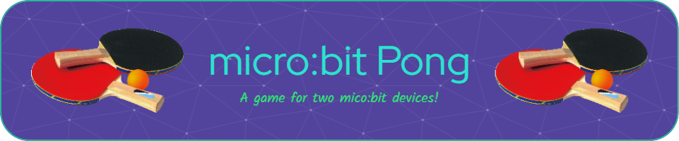

## Table of Contents:
- [About](#about)
- [Features](#features)
- [Installation](#installation)
- [Demonstration](#demonstration)
- [Questions?](#questions)

## 🏓 About:
micro:bit pong is a simple program meant to run on two BBC micro:bit devices simultaneously. It is game that is similar table tennis. Each player controls an in-game paddle con their device, moving it up and down the left or right side of the screen. Players use the paddles to hit a ball back and forth. A player wins when their competitor fails to return the ball.

## Features:
- 5 by 10 display
- Difficuly scaling
- Wireless play

## Installation
1. Coming Soon!

## Demonstration
Coming Soon!

## Questions?
Feel free to ask!